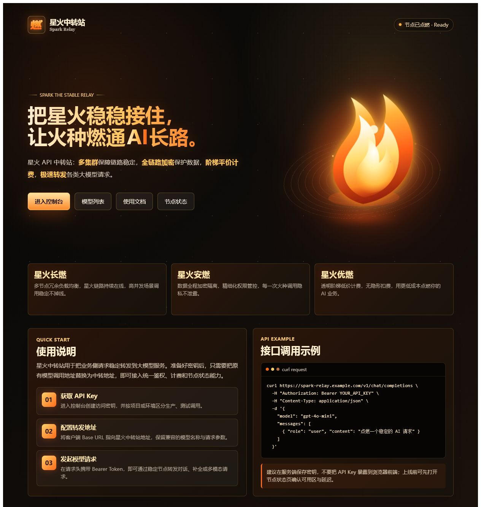

# 星火 API 中转站首页

星火 API 中转站的静态首页，展示品牌视觉、核心能力、接入流程和真实 API 地址。

## 项目文件

- 首页：`outputs/spark-relay-home.html`
- 首页预览：`outputs/spark-relay-home-preview.png`
- 使用文档：`docs/USAGE.md`

## 本地运行

项目不需要安装 Node.js 依赖。进入仓库根目录后运行：

```powershell
python -m http.server 8000 --directory outputs
```

打开 <http://127.0.0.1:8000/spark-relay-home.html> 查看首页。

## 首页入口

首页按钮已连接到实际服务：

| 入口 | 地址 |
| --- | --- |
| 进入控制台 | <https://zz.ncriscs.com/dashboard> |
| 模型列表 | <https://zz.ncriscs.com/available-channels> |
| 使用文档 | <https://fcn7al09nyc3.feishu.cn/wiki/D358wpMNyiHnflkvtTjcD9VGnJg> |
| 节点状态 | <https://zz.ncriscs.com/monitor> |

控制台、模型列表和节点状态由目标站点处理登录状态；已登录时会直接进入对应页面。

## API 接入

API Base URL：`https://zz.ncriscs.com`

准备好 API Key 后，使用 Bearer Token 调用兼容接口：

```bash
curl https://zz.ncriscs.com/v1/chat/completions \
  -H "Authorization: Bearer YOUR_API_KEY" \
  -H "Content-Type: application/json" \
  -d '{
    "model": "gpt-4o-mini",
    "messages": [
      { "role": "user", "content": "点燃一个稳定的 AI 请求" }
    ]
  }'
```

不要把 API Key 写入浏览器前端或提交到代码仓库。完整接入步骤见 [`docs/USAGE.md`](docs/USAGE.md)。

## 界面展示


